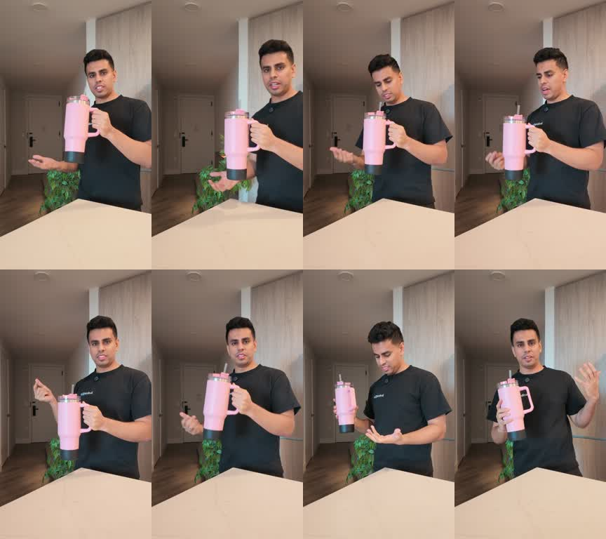
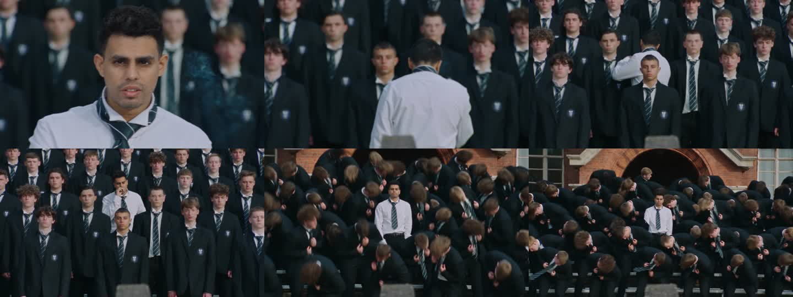

# Samin character recreation

Create a video with the requested person as the lead while preserving the source performance. Keep every version and distinguish a generated likeness from a verified likeness. Follow the user's chosen provider and authorization; this skill does not authorize publishing someone else's private reference media.

## The demonstrated workflow

1. **Prepare the source.** Inspect the actual clip. Identify the lead, outfit, surroundings and camera movement. Trim the requested range with `scripts/prepare.py trim`; use H.264, exactly bounded duration, and a silent generation input. Preserve an audio-bearing source separately. For YouTube, use a supported downloader only where available; if retrieval fails, request the clip. A link alone is not an uploaded model reference.
2. **Gather identity evidence.** Inspect the user's portrait and reference video. Extract clear front and three-quarter views, rejecting motion blur and heavy occlusion. The supplied reference video is identity evidence; the source film remains the motion driver.
3. **Create the scene keyframe.** Use the available image editor with the source frame as edit target and the person's photos as identity references. Preserve their actual face proportions, nose, eyes, lips, hairline and skin texture. Keep the scene and wardrobe. Explicitly exclude the reference room, props and clothing. Display the still before animation; for a likeness-critical task, obtain the user's judgment when the match remains uncertain.
4. **Transfer the performance.** Use Higgsfield Genjutsu Motion Transfer when copying choreography and camera motion to the approved image. Object Swap is the alternative when the main goal is a localized replacement. Inspect the current model schema: never guess the API path from the model's display name.
5. **Quote, then submit once.** Confirm uploads first. Request a live quote for the exact input, record settings and the returned request ID, and honor the user's spending authorization. With the direct API, do not deduct launch discounts again from an authenticated quote. Treat a submission timeout as unknown; reconcile it before retrying.
6. **Review and version.** Inspect the beginning, turns, profiles and wide shots. Check face drift, anatomy, extras, scene changes and timing. In Samin Studio, keep each regenerated version on the same project and move completed work into Review. Approval is a user's decision; don't automatically mark it Approved.
7. **Restore audio and deliver.** Use `scripts/prepare.py audio` to align the original source audio with the generated video. Verify both streams and exact duration with ffprobe. Show the MP4, model and quote. Report actual charges only when independently verified.

## Visual reference

These images document the example used to develop this workflow, not a guarantee of model output.

**Useful identity angles from a reference video**

**Scene keyframe prepared with the user's likeness**

**Motion-transfer result across the opening sequence**

## Prompt pattern

> Transfer the source video's lead performer's actions and camera motion to the person in reference image 1. Image 1 defines the target scene and identity; additional images are views of the same person for facial consistency. Preserve the person's facial proportions through every turn. Keep the source wardrobe, surrounding people, lighting and choreography. Do not import the reference room or props and do not blend the face with the original performer.

## Model details to recheck

The workflow was verified on 2026-09-18 with connector model `hf_mult_motion_control` (Object Swap: `hf_mult_replace_object`). Direct API catalog paths were `higgsfiled/genjutsu/motion-transfer/v1.0` and `higgsfiled/genjutsu/object-swap/v1.0` (the provider's spelling is intentional). The API input used `prompt`, `video_url`, `image_urls`, and `resolution`. Check current [model docs](https://open.higgsfield.ai/explore) before future runs.

A 30.001-second audio stream caused the first submission to fail. The silent, exactly 30-second input succeeded; audio was restored locally. A lone portrait with Object Swap produced a weak likeness. A separately prepared scene keyframe plus video-derived angles improved the Motion Transfer result, with some drift and background changes remaining.

## Samin Studio

Create a project → choose **Put yourself in the scene** → add your prepared clip and references → save → get a quote → generate → review → create a new version if needed → approve. Store feedback against the specific version. Client users see only their assigned project. Source trimming, keyframe creation and final audio muxing can be performed with this skill; the web app currently accepts prepared media for generation.
